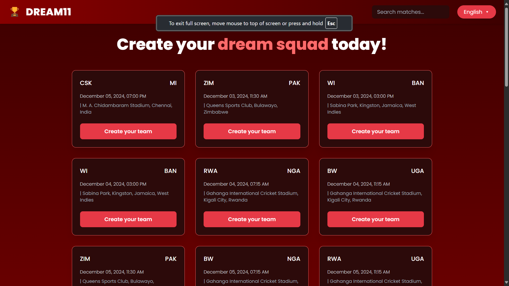
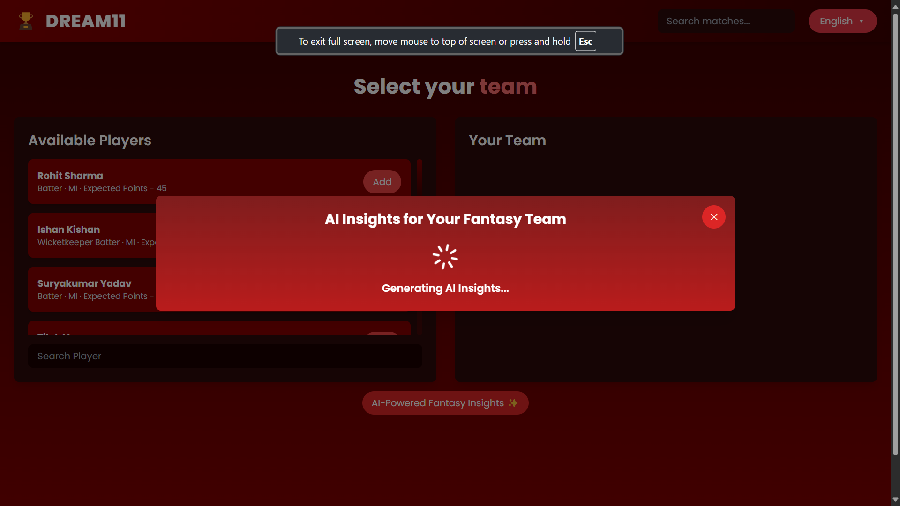
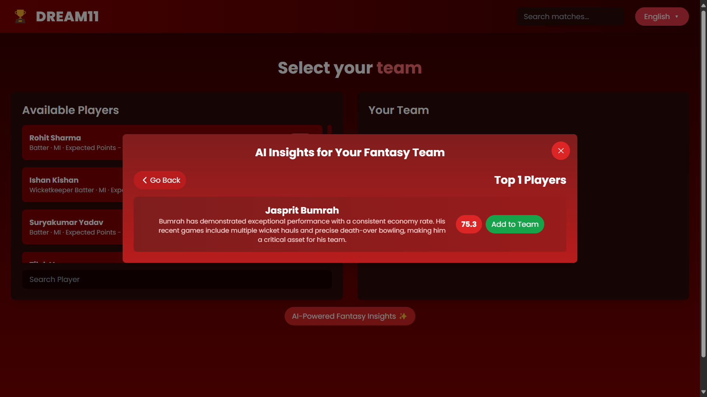
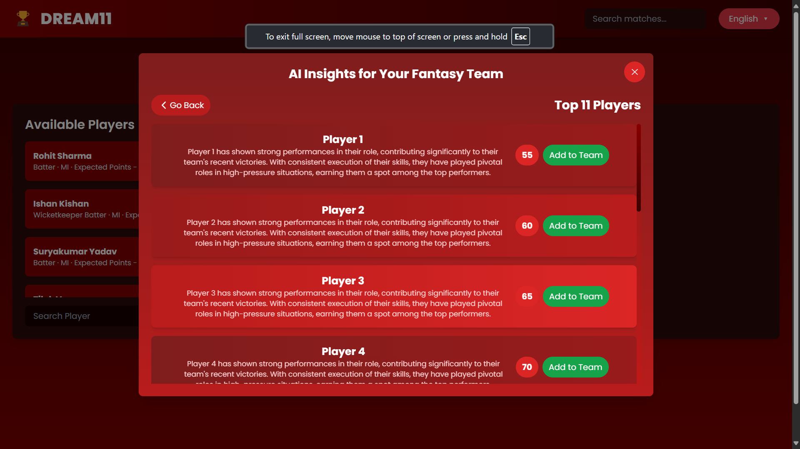
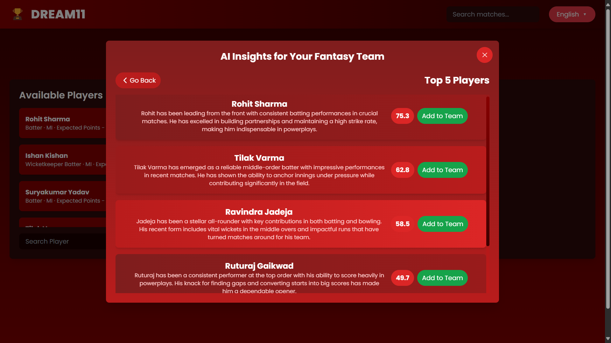

# Dream11 ML-Powered Fantasy Sports App

Welcome to the Dream11 ML-Powered Fantasy Sports App! This application revolutionizes fantasy sports by leveraging Machine Learning (ML) models to provide accurate player predictions, match insights, and optimal team combinations for users.

---

`
├── README.md                   <- Project overview and usage instructions


├── data                        <- Data folder with all stages of data
│   ├── interim                 <- Intermediate data files generated during processing
│   ├── processed               <- Finalized datasets ready for modeling
│   └── raw                     <- Original data as downloaded
│       ├── cricksheet_data     <- Raw data from Cricksheet
│       └── additional_data     <- Raw data from other sources, if any


├── data_processing             <- Scripts to process data
│   ├── data_download.py        <- Download all project data using this script. All raw data sources are processed here before further use.
│   └── feature_engineering.py  <- Handles all data manipulation and feature engineering for the project.


├── docs                        <- Documentation and project demo
│   └── video_demo              <- Walk-through video, covering setup, UI, and functionality


├── model                       <- Modeling scripts for training and prediction
│   ├── train_model.py          <- Model training script
│   └── predict_model.py        <- Prediction script with trained models


├── model_artifacts             <- Storage for trained models
│                             (Includes pre-trained model for Product UI and models from Model UI)


├── out_of_sample_data          <- Sample dummy data for evaluation matches, After submission is done we will put testing data here (4th - 14th Dec)
                                in the same format as the sample data provided. This folder should be well integrated with Model UI where it will
                                automatically append the new data with already avalaible data from cricksheet.


├── rest                        <- For any miscellaneous requirements not covered by other folders 

└── UI                          <- All files related to the user interface 
`


## Table of Contents
1. [Introduction](#introduction)
2. [Key Features](#key-features)
3. [How It Works](#how-it-works)
4. [Technology Stack](#technology-stack)
5. [ML Models and Functionality](#ml-models-and-functionality)
6. [Installation](#installation)
7. [Usage](#usage)
8. [Screenshots](#screenshots)

---

## Introduction

Our app combines the excitement of fantasy sports with cutting-edge ML capabilities to enhance the gaming experience. Users can draft teams, analyze performance predictions, and gain valuable insights, giving them an edge in their fantasy leagues.

---

## Key Features

- **ML-Powered Player Suggestions**: Get best 11 player suggestions based on historical data, player performance, and match conditions.
- **Optimal Team Selection**: The app uses ML models to help users choose the best possible fantasy team combinations based on current form, stats, and match conditions to maximize their profit.
- **User-Friendly Interface**: Clean and intuitive design to provide a seamless experience while creating fantasy teams.
- **Model UI**: Training Period, Testing Period, CSV Input. Output is CSV. Output contains for each match best 11 players, predicted 11 players, fantasy points for all players row wise and there MAE for all matches in testing period.

---

## How the App Works  

### 1. **Data Collection**  
The app collects comprehensive cricket data from reliable sources such as Cricsheet. This includes:  
- Player performance statistics across previous matches.  
- Contextual match data such as stadium, pitch conditions, and weather reports.  
- Team composition details, including full squads for each match.  

---

### 2. **Model Training**  
- ML models are trained using historical player performance data, contextual match factors, and additional game-relevant variables.  
- Strict adherence to training constraints ensures fair predictions, avoiding data beyond predefined cut-off dates.  
- Algorithms like Random Forests, Decision Trees, and Neural Networks are leveraged for robust prediction outcomes.  

---

### 3. **Prediction Generation**  
- The trained ML model predicts player performances for upcoming matches. Predictions include:  
  - **Expected Fantasy Points**: Performance estimates for each player.  
  - **Ranked Player Lists**: Highlights top players based on contextual factors.  
- Features explainability is integrated through tools like **SHAP**, providing detailed insights into why a player is predicted to perform well.  

---

### 4. **Team Selection**  
- Users receive personalized, AI-driven recommendations for creating their Dream Team.  
- The app suggests:  
  - **Top Players**: Highlights individual performers.  
  - **Top 5 Players**: Provides a short list for quick decisions.  
  - **Dream Team**: Recommends the best XI adhering to Dream11 constraints, such as player composition and budget limits.  
- Additional guidance is offered through interactive features like audio and visual aids to simplify team creation for all user levels.  

---

### 5. **Enhanced User Interface**  
- The app integrates advanced UI tools, such as **Generative AI-powered audio and video descriptions**, to guide users through the team-building process interactively.  
- Real-time feedback and insights ensure users make confident, informed decisions, creating a seamless and engaging experience.  


---

## Technology Stack

- **Frontend**: React JS with Tailwind CSS for USER UI and Gradio for model UI (depending on your implementation)
- **Backend**: Python / FAST API
- **Machine Learning**: Python (scikit-learn / PyTorch)

---

## ML Models and Functionality

We use the following models to enhance the fantasy sports experience:

- **Player Performance Prediction Model**: Uses player statistics and match data to predict individual performance.
- **Optimal Team Selection Model**: Provides the best possible team based on budget constraints, player form, and match conditions.
- **Match Result Prediction Model**: Predicts the outcome of the match based on historical match data and team performance.

---

## Installation

### Prerequisites
- Fast API (for backend)
- Python 3.x (for ML model)
- React, Gradio (for frontend)

### Steps to Install

1. Clone the repository:
    ```bash
    git clone https://github.com/your-username/dream11-app.git
    ```

2. Install the necessary dependencies:
    - For frontend:
      ```bash
      cd frontend
      npm install
      ```

3. Run the app:
    - For frontend:
      ```bash
      npm run dev
      ```
    - For backend:
      ```bash
      uvicorn main:app
      ```
      
---

## User Interface Usage

1. **Home Page**: The Home Page serves as the starting point for users and provides the following features:

    - A comprehensive list of all upcoming matches with details including the venue, date, and time.
    - Easy navigation to explore match-specific details and proceed to create fantasy teams.
    - Quick access to key game statistics and match analysis.

2. **Player Details Page**: The Player Details Page dynamically displays information about the players from the playing XI of both teams:
    - Dynamic Player Cards:
      - Detailed stats for each player, including their average fantasy score and recent performance metrics.
      - Visual indicators to show players' roles (e.g., batsman, bowler, all-rounder).
    - Easy sorting and filtering options to help users analyze player performance efficiently.

3. **Adding and Managing Players**: Users can seamlessly create and manage their fantasy teams:
    - ***Add Players***: Select players to include in your Dream11 team directly from the player cards.
    - ***Remove Players***: Effortlessly remove players from your team with a single click if needed
    - ***Player Limits***: Visual indicators to guide users in adhering to team constraints (e.g., budget limits, team composition rules).

4. **AI Powered Fantasy Insights**: 
  Leverage cutting-edge AI to make data-driven decisions for your fantasy team:
    - ***Predict Top Player***
      - Identifies the best-performing player for the upcoming match based on the ML Model’s predictions.
      - ***Includes:***
        - ***Expected Fantasy Points***: Estimated points the player is likely to earn.
        - ***SHAP-Based Explanation***: Detailed reasoning behind the prediction, showing key factors influencing the player’s performance.
        - ***Audio Playback Option***: AI-generated voice narration explaining the prediction for an immersive experience.
    - ***Predict 5 players***
      - ***Ranked List*** : Players ranked by their expected performance.
      - ***Expected Fantasy Points*** : Performance scores for each player based on advanced ML models.
      - ***SHAP-Based Explanation***: Clear insights into why each player is expected to perform well.
      - ***Audio Playback Option***: Narrated explanation of predictions for user convenience.
    - ***Predict DREAM TEAM***
      - Generates a full fantasy dream team consisting of the 11 best-performing players for the match.
      - ***Includes***:
          - ***Optimal Team Composition***: Players selected from both teams, optimized for roles, budget, and performance.
          - ***Expected Fantasy Points***: Cumulative score projection for the Dream Team.
          - ***SHAP-Based Explanation***: Provides key insights into the selection rationale, highlighting factors like player form, match conditions, and historical performance.
          - ***Audio Playback Option***: Explains the Dream Team’s predictions in a clear, AI-generated voice for an engaging user experience.

---

## Screenshots



---


---


---



---



---



---

---
